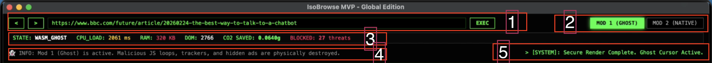

# 🛡️ IsoBrowse MVP: The Hardware-Telemetry Browser

**Take back control of the web. Listen to the heartbeat of websites, save resources, and browse consciously.**

---

## 🚀 The Vision: Why IsoBrowse?

Ask yourself: *Are modern browsers really protecting us, or do they just blindly consume our computer's resources?*

The web is becoming heavier and more complex every day. Opening just a few tabs can cause your computer to freeze, your fans to spin loudly, and your battery to drain. Users deserve better. You should be able to simply read the news or browse an article without your machine struggling under the weight of hidden scripts, trackers, and bloated code.

**IsoBrowse is built on a simple premise: Control belongs to the user.** We didn't just build another browser; we attached real-time **hardware telemetry** to the web engine. Instead of passively rendering a webpage, IsoBrowse actively *listens* to its hardware footprint (CPU, RAM, DOM). A user who can see and listen to a website's behavior is a more conscious and protected user.

### 🌍 A Platform for Efficiency and Security
Because we are monitoring the actual "heartbeat" of websites, the possibilities are endless:

* **Unmatched Efficiency:** By utilizing our isolated Rust engine (Ghost Mode), we are currently achieving up to **70% better resource efficiency** on heavy, ad-cluttered news sites. Just pure content, zero bloat.
* **Burying Web3 Phishing:** One of the most exciting initial use cases for our telemetry is Web3 security. Fake or cloned websites inherently have different CPU, RAM, and DOM structures than the originals. With IsoBrowse, Web3 wallet drains could soon be buried in history. 

IsoBrowse is an inclusive project open to new ideas. Whether a company only wants to integrate our "Ghost Mode" for secure reading, or a crypto user wants a hardware-monitored vault, the architecture is designed to adapt.

---

## ⚙️ Dual Engine Architecture

IsoBrowse operates on two distinct, user-toggleable engines to give you absolute control over your web experience:

### 👻 MOD 1 (Ghost Mode)
* **The Concept:** A hyper-secure, WebAssembly (WASM) based isolated environment. 
* **How it works:** Malicious JavaScript loops, trackers, and hidden ads are physically destroyed at the network level before rendering.
* **Result:** Pages load instantly, securely, and read-only. Unclickable. Unhackable.

### 🟢 MOD 2 (Native/Vault Mode)
* **The Concept:** The unrestricted, full-web experience with a built-in security shield.
* **How it works:** Hooks into OS-level telemetry. It continuously monitors the active tab's CPU, RAM, and DOM usage.
* **Result:** If hardware anomalies are detected (e.g., memory leaks, high idle CPU, hidden drainer scripts), the browser visually alerts you and changes the system state.

---

## 🎛️ The Dashboard: Your Security Cockpit

The top panel of IsoBrowse acts as your real-time telemetry dashboard. Here is a quick guide to what you are looking at:

**[ 1 ] Navigation & Execution:** Standard back/forward controls and the address bar. The `EXEC` button initiates the secure rendering process.
**[ 2 ] Engine Toggle (MOD 1 / MOD 2):** Seamlessly switch between the hyper-secure WASM Ghost environment and the Native full-web experience.
**[ 3 ] Hardware Telemetry (The 'Heartbeat'):** * **STATE:** Displays your current security context. Turns red and flashes `🚨 DRAINER RISK!` if anomalies are detected.
* **CPU_LOAD & RAM:** Real-time hardware footprint of the page.
* **DOM:** Total number of HTML elements. Phishing sites often have massive, bloated DOM structures.
* **CO2 SAVED & BLOCKED:** Eco-metrics showing energy saved by destroying ad-scripts.
**[ 4 ] Info Panel:** Provides immediate context on the active mode's rules and restrictions. 
**[ 5 ] Terminal System Log:** Real-time Rust kernel logs showing you exactly what the browser is doing behind the scenes.

---

## 📥 Installation (Try the MVP)

You can test the MVP locally on your machine. Currently compiled for macOS and Windows.

1. Go to the [Releases](#) tab 
2. Download the `.dmg` (macOS) or `.exe` (Windows) or zip file.
3. Run the application and explore the web through a new, transparent lens.

*Note: This is an MVP (Minimum Viable Product). You may encounter bugs on heavily dynamic SPA sites while in Ghost Mode. We are actively building V2.0 to handle dynamic architectures gracefully.*

---

## 🧪 An Experimental Journey
IsoBrowse is currently an MVP (Minimum Viable Product) and an open experiment. This dual-engine, hardware-telemetry approach is a proof of concept. If the community finds value in this vision, we have a massive roadmap ahead—including a custom Headless Rendering Engine for highly dynamic sites and more customizable telemetry hooks. Try it, break it, and let us know what you think. Your feedback will shape the future of this browser!

---

## 📜 License
This project is licensed under the **GNU General Public License v3.0 (GPLv3)**. See the `LICENSE` file for details. 
