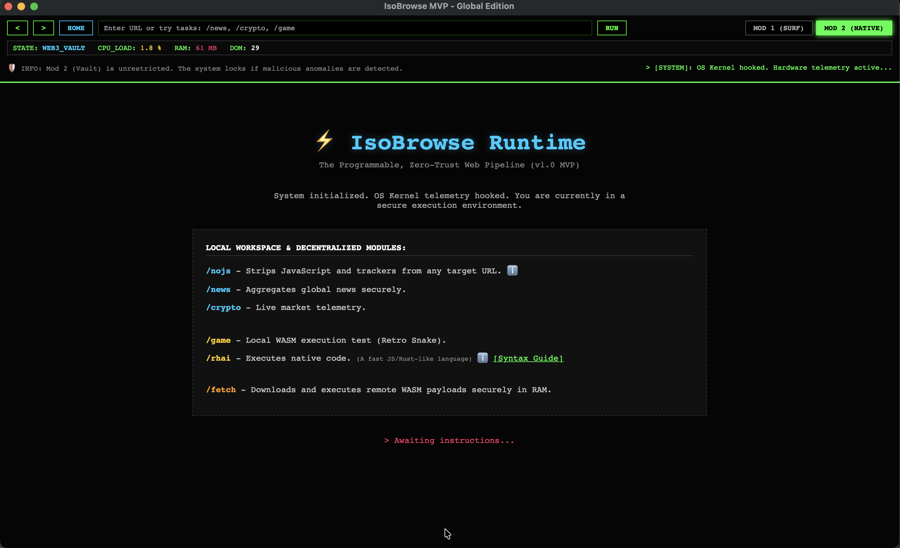
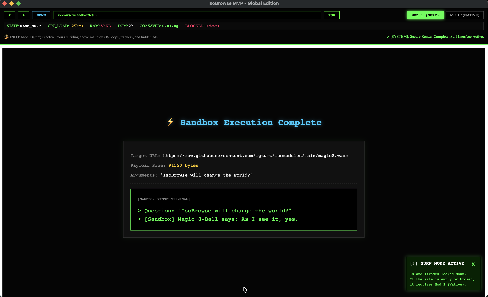

# ⚡ IsoBrowse MVP: The Experimental Zero-Trust Web Pipeline & Workspace

**Take back control of the web. IsoBrowse is not just a browser; it's a programmable, zero-trust execution environment. A paradigm shift in web architecture.**

Stop trusting the web blindly. IsoBrowse treats web surfing as a controlled execution task, allowing you to intercept payloads, execute remote WebAssembly modules securely, and run native scripts directly from the address bar.

---

## 📸 System Interface

*The Local Workspace & Decentralized Modules Dashboard.*

*Executing a dynamic remote WebAssembly payload directly from a GitHub raw link into RAM.*

---

## 🌍 The Vision: A Browser as a Terminal

Modern browsers have become massive, bloated operating systems that let websites run thousands of lines of hidden JavaScript, draining your CPU, RAM, and privacy. 

IsoBrowse changes the rules. It turns the traditional "Address Bar" into a **Command-Driven Terminal**. You don't just visit URLs; you execute pipelines and modules.

### 📦 The Sandbox Engine (`/fetch`)
Why download and install apps when you can fetch them securely into RAM? IsoBrowse features a built-in decentralized `wasmtime` application runner.
> /fetch https://raw.githubusercontent.com/user/repo/calc.wasm 250 x 4
> /fetch https://raw.githubusercontent.com/igtumt/isomodules/main/magic8.wasm "ASK A QUESTION!" (example)

* **Direct to RAM:** The `.wasm` binary is fetched directly from the internet.
* **Zero-Trust:** Executed within an ultra-secure WASI P1 sandbox. The app cannot access your local files or network. Output is piped directly back to the IsoBrowse Cyber-Terminal UI.

### ⚡ The Native Engine (`/rhai`)
Need to run quick logic without fetching external WASM? Write and execute code directly inside the browser using the embedded **Rhai Engine** (a fast, JS/Rust-like scripting language).
> /rhai let x = 50; let y = 4; x * y

*Executes natively in < 6ms without relying on external web servers or slow JavaScript V8 engines.*

### 🛠️ The Task Pipelines
Instead of relying on bloated external websites, IsoBrowse can synthesize data locally using internal tasks:
* `/nojs <url>` - Strips all JavaScript and trackers from any target URL before rendering.
* `/news` - Aggregates global news purely in Rust, bypassing ad-networks.
* `/crypto` - Live market telemetry rendered in an isolated local container.
* `/game` - Boots a purely local, offline WASM Cyber-Snake game to demonstrate runtime capabilities.

---

## 🛡️ Core Web Architecture: Dual-Mode Run

When you aren't using the terminal commands, IsoBrowse acts as a hyper-secure web browser with two distinct execution modes:

### 🏄 MOD 1: Surf Mode (The WASM Decontamination Chamber)
* **The Concept:** A strictly sandboxed WebAssembly runtime that processes raw HTML.
* **How it works:** The Rust engine intercepts the payload at the network level. Inside the WASM cell, it physically removes `<script>` tags, restricts `<iframe>` elements, and destroys hidden trackers *before* rendering. 
* **The Result:** A purely static, ultra-lightweight, read-only version of the web.

### 🟢 MOD 2: Native Vault (The Monitored Web)
* **The Concept:** The unrestricted, full-web experience with a built-in kernel-level security shield.
* **How it works:** Hooked directly into your OS hardware telemetry. It continuously monitors the active tab's CPU load, RAM footprint, and DOM mutations in real-time.
* **The Result:** If hardware anomalies are detected (e.g., massive memory leaks, high idle CPU from crypto-miners, or extreme DOM spikes from UI-cloning drainer scripts), the system locks down and visually alerts you.

---

## 📥 Download and Run (macOS MVP)

You can test the MVP locally on your machine. Currently packaged for macOS (Apple Silicon & Intel).

1. Go to the [Releases](https://github.com/igtumt/isobrowse/releases) tab and download `IsoBrowse-v1.0-Mac.zip`.
2. Extract the ZIP file to your `Downloads` or `Applications` folder.
3. **Important macOS Security Note:** Because IsoBrowse is an open-source experiment and not signed with a paid Apple Developer certificate, macOS Gatekeeper will incorrectly flag it as "damaged". To bypass this and remove the quarantine flag, run this single command in your terminal:
   
   xattr -cr /path/to/your/extracted/IsoBrowse.app

4. Double click `IsoBrowse.app` to launch the zero-trust runtime!

---

## ⚙️ Build and Run from Source

**Prerequisites:**
* Rust Toolchain (`cargo`)
* LLVM and Clang (Install via Homebrew: `brew install llvm`)
* WASI-SDK (The build script handles dynamic linking)

**Installation:**

git clone https://github.com/igtumt/isobrowse.git
cd isobrowse
sh run.sh

*(Note: You may encounter UI bugs on heavily dynamic SPA sites while in Surf Mode (Mod 1). See Roadmap below).*

---

## 🗺️ V2.0 Roadmap: A Community-Driven Platform

IsoBrowse is built with a "Platform-First" mindset. Future development priorities will be heavily directed by developer adoption and WASM standards:

* **WASI-HTTP & Network Sockets:** Adapting to the bleeding edge of WebAssembly. As the official WASI working groups release new standards, the IsoBrowse core engine will evolve to support network-capable WASM modules safely.
* **Headless Rendering Engine:** Upgrading SURF MODE (Mod 1) to securely process Single Page Applications (SPAs) and ethically bypass extreme anti-bot shields (Cloudflare, DataDome) entirely within the WASM sandbox.
* **IsoModules Registry:** Establishing a public, open-source registry where any developer can write a tool in Rust/C/Zig, compile it to WASM, and users can instantly `/fetch` and run it without installation.

---

## 📜 License
This project is licensed under the **GNU General Public License v3.0 (GPLv3)**. See the `LICENSE` file for details.

