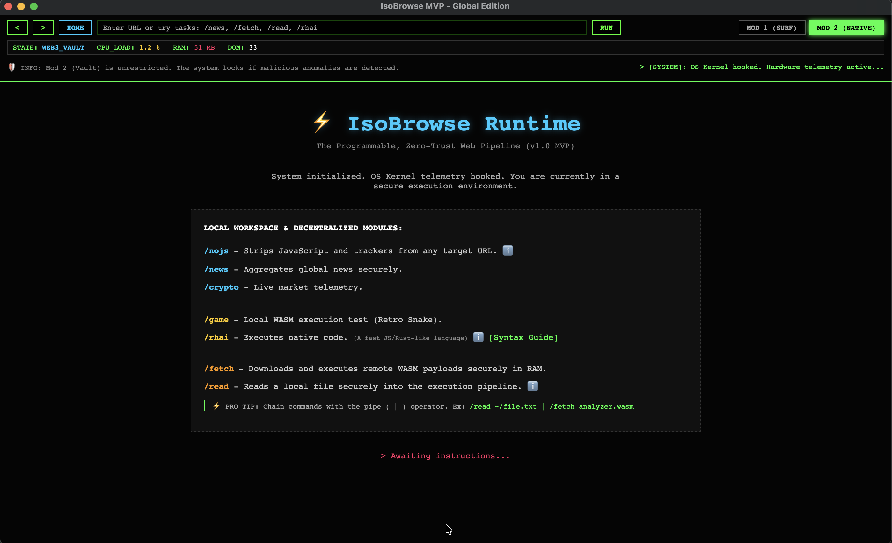

https://github.com/user-attachments/assets/8dfb66ef-c7c2-45b6-adc3-c48af84d57f9

# ⚡ IsoBrowse MVP: The Experimental Programmable Web & Local Runtime

**IsoBrowse is not just a browser — it is a programmable execution environment for the web and local data.**

IsoBrowse is an experimental web runtime that turns the browser address bar into a command-driven interface. Instead of simply rendering websites, IsoBrowse treats the web as inputs that flows through controlled runtimes, sandbox environments, and IsoModules pipelines.

Modern browsers execute large amounts of untrusted JavaScript by default. IsoBrowse flips this model. 

Instead of blindly executing websites, IsoBrowse processes web content through secure runtimes and modular pipelines where the user remains in absolute control.

**In IsoBrowse:**
* Web pages become inputs.
* Modules become tools.
* The browser becomes a programmable runtime.

This allows users to intercept payloads, execute sandboxed WebAssembly modules, and run native scripts directly from the address bar — transforming web browsing into a transparent and fully programmable experience.

---

## 📸 System Interface

https://github.com/user-attachments/assets/20dd5d89-8986-4b97-a5d4-416e6e61643e


<br>
<em>The Local Workspace & Decentralized Modules Dashboard.</em>


<br>
<em>Executing a dynamic remote WebAssembly payload directly from a GitHub raw link into RAM.</em>

DEMO


## 💻 Example Session

```text
> /nojs https://news.ycombinator.com
Rendering clean page...

> /rhai 40 + 2
42

> /read ~/Desktop/server.log | /rhai pipe_data.len()
1543

> /fetch https://raw.githubusercontent.com/igtumt/isomodules/main/calc.wasm 5 x 6
30
```

---

## 🌍 The Vision: A Browser as a Terminal

Modern browsers have become massive operating systems that let websites run thousands of lines of hidden JavaScript, draining your CPU and RAM. 

**Normal Browsers:**
`URL` ➔ `HTML` ➔ `JS Execute` ➔ `Render`

**IsoBrowse Architecture:**
`Sources (Web/Local Data)` ➔ `IsoBrowse Runtime` ➔ `Pipeline Execution` ➔ `UI / Render`

IsoBrowse changes the rules. It turns the traditional "Address Bar" into a **Command-Driven Terminal**. You don't just visit URLs; you execute pipelines and modules. 

**IsoBrowse combines a web browser, a WASM runtime, Unix pipelines, local scripting, and IsoModules.**

### 📦 The IsoModules Ecosystem

IsoBrowse is built around **IsoModules** — sandboxed WebAssembly applications that run inside the IsoBrowse runtime.

Developers can build tools in **Rust, C, or Zig**, compile them to WASM, and publish them to any public repository.  
Users can fetch and execute these modules instantly without installation.

IsoModules transform the browser into a **modular execution platform** where web data, local files, and remote modules can be combined through pipelines.

🧩 The Ecosystem
We are experimenting with an open ecosystem of small WebAssembly tools that can run inside the IsoBrowse runtime, early adopters welcome.

If you build an IsoModule we will list it in the official registry.
👉 **[Explore or Contribute to Awesome_IsoModules](https://github.com/igtumt/Awesome_IsoModules)**


---

### Built-in IsoModules (MVP)

IsoBrowse ships with a few native modules to demonstrate the system:

* `/nojs <url>` — renders a clean version of any webpage by stripping JavaScript and trackers.
* `/news` — fetches and aggregates global news.
* `/crypto` — displays live cryptocurrency telemetry.
* `/game` — launches a local offline Cyber-Snake game.

---

### Fetchable IsoModules

Developers can distribute modules as standalone `.wasm` binaries.  
Users can fetch and execute them directly from the address bar:

Examples : 
```text
> /fetch https://raw.githubusercontent.com/igtumt/isomodules/main/calc.wasm 50 x 2
> /fetch https://raw.githubusercontent.com/igtumt/isomodules/main/magic8.wasm "ASK A QUESTION!"
```

https://github.com/user-attachments/assets/89bd418f-2d31-4ee3-93bc-42df948fedb3

* **Direct to RAM:** The `.wasm` binary is fetched directly from the internet.
* **Sandbox:** Executed within a WASI P1 sandbox. The app cannot access your local files or network.


### ⚡ The Native Engine (`/rhai`)
Write and execute code directly inside the browser using the embedded **Rhai Engine** (a fast scripting language).

```text
> /rhai let x = 50; let y = 4; x * y
```

https://github.com/user-attachments/assets/9ae60d6b-fd24-4cb8-b604-f870980c08a8


### 📂 Local File Access (`/read`)
Securely read local data directly into the execution sandbox. Your data stays purely in your local RAM.

```text
> /read ~/Desktop/server.log
```

### 🔗 The Pipeline Operator (`|`)
Bring the philosophy of Unix pipes directly to the web browser. The `|` operator feeds the output (`pipe_data`) of one task into the input of the next.

```text
> /read ~/Desktop/server.log | /fetch https://raw.githubusercontent.com/.../parser.wasm | /rhai "Parsed Output:\n" + pipe_data
```

https://github.com/user-attachments/assets/203b8391-5170-4b86-add1-e2585818b128

*Example: We select the critical text in our desktop file and filter it in the UI using Rhai:*
```text
> /read ~/Desktop/server.log | /rhai let res=""; let lines=pipe_data.split("\n"); for x in lines { if x.index_of("CRITICAL") != -1 { res += x + "\n"; } } res
```
---


## 🛡️ Core Web Architecture: Dual-Mode Run

When you aren't using the terminal commands, IsoBrowse acts as an isolated web browser with two distinct execution modes:

### 🏄 MOD 1: Surf Mode (The WASM Decontamination Chamber)
* **The Concept:** A sandboxed WebAssembly runtime that processes raw HTML.
* **How it works:** The Rust engine intercepts the payload at the network level. Inside the WASM cell, it removes `<script>` tags, restricts `<iframe>` elements, and drops trackers *before* rendering. 
* **The Result:** A purely static, lightweight, read-only version of the web.

### 🟢 MOD 2: Native Vault (The Monitored Web)
* **The Concept:** The standard web experience with hardware telemetry.
* **How it works:** It continuously monitors the active tab's CPU load, RAM footprint, and DOM mutations in real-time.
* **The Result:** If hardware anomalies are detected (e.g., massive memory leaks or high idle CPU), the system locks down the tab and visually alerts you.

---

## 📥 Download and Run (macOS MVP)

Currently packaged for macOS (Apple Silicon & Intel).

1. Go to the [Releases](https://github.com/igtumt/isobrowse/releases) tab and download `IsoBrowse-v1.0.2-Mac.zip`.
2. Extract the ZIP file to your `Downloads` or `Applications` folder.
3. **Important macOS Security Note:** Because IsoBrowse is an open-source experiment and not signed with a paid Apple Developer certificate, macOS Gatekeeper will incorrectly flag it as "damaged". To bypass this, run this single command in your terminal:
   
   ```bash
   xattr -cr /path/to/your/extracted/IsoBrowse.app
   ```

4. Double click `IsoBrowse.app` to launch the runtime.

---

## ⚙️ Build and Run from Source

**Prerequisites:**
* Rust Toolchain (`cargo`)
* LLVM and Clang (`brew install llvm`)
* WASI-SDK

**Installation:**
```bash
git clone https://github.com/igtumt/isobrowse.git
cd isobrowse
sh run.sh
```

---

## 🚧 Current Limitations (MVP)

IsoBrowse is highly experimental. As a V1.0 release, you should be aware of the following constraints:

* **WASM Support is CLI/Text-Centric:** The current sandbox natively supports WASI P1. This means modules that return text, data, or math (like parsers, calculators, scripts) work perfectly. However, complex WASM modules requiring WebGL, Canvas, or 3D rendering will not execute in the terminal yet.
* **Rhai Sandbox Limits:** The embedded Rhai engine is strictly sandboxed. Heavy OS-level commands or highly complex external library calls within Rhai might be restricted or unsupported in this iteration.
* **Surf Mode (Mod 1) Rendering:** Since Surf Mode aggressively strips all JavaScript, heavily modern Single Page Applications (SPAs like React/Vue apps) might render as blank pages or broken layouts. It is currently optimized for text-heavy, document-based websites (like Hacker News, blogs, wikis).
* **Mod 2:** If you click on ads, the browser will currently close itself.
* **The Pipeline (`|`) is currently Argument-based:** In this V1.0 MVP, the pipeline operator (`|`) passes data to WASM modules as command-line arguments rather than true `stdin` streaming. This works perfectly for short strings and basic commands, but will hit OS argument limits for large files (like heavy Markdown parsing). 
* **Next Up (V1.1):** Implementing true `stdin/stdout` byte-streaming for the pipeline is our #1 priority. 

---

IsoBrowse is currently a proof-of-concept MVP. While we have tested the core sandbox and basic pipelines, **we have not edge-tested every single command.** * `/read` might choke on a 10GB file.
* Some WASM modules might hit undocumented memory limits.
* There are absolutely limitations and bugs we haven't discovered yet.

**The code is 100% open.** We built this to prove that the "Address Bar as a Terminal" concept works. If you break the sandbox, find a pipeline bottleneck, or hit a weird bug—congratulations! Please open an Issue or submit a PR. Let's build and refine this ecosystem together.

---

## 🗺️ V2.0 Roadmap

Future development priorities will be heavily directed by developer adoption and WASM standards:

* **Advanced Pipeline Logic (AND, OR, NOT):** Introducing logical operators (`&&`, `||`, `!`) to the IsoBrowse command bar for complex data filtering.
* **Iterative File System Writing (`/write`):** We plan to develop this step-by-step. Future updates will introduce a permission-based `/write` command to save pipeline outputs back to local disk without breaking sandbox isolation.
* **WASI-HTTP & Outbound Networking:** Adapting to new WebAssembly standards. Soon, modules will be able to make outbound requests (e.g., piping processed data directly into APIs via POST).
* **Headless Rendering Engine:** Upgrading SURF MODE to process Single Page Applications (SPAs) entirely within the WASM sandbox.
* **Visual IsoModules Store:** Evolving the `/fetch` registry into a public, visual app store inside the browser.

---

## 📜 License
This project is dual-licensed under the terms of both the MIT License and the Apache License (Version 2.0). 
See the `LICENSE-MIT` and `LICENSE-APACHE` files for details.

