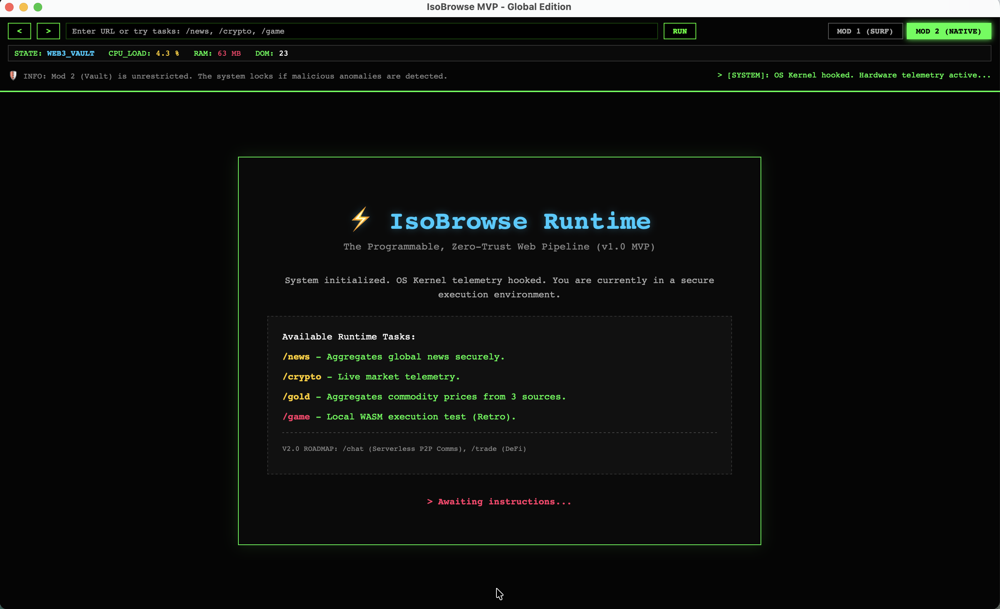
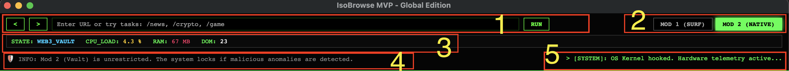

# 🛡️ IsoBrowse MVP: The Sandbox Browser Runtime

**Take back control of the web. Listen to the heartbeat of websites, save resources, and browse consciously. A paradigm shift in web architecture.**

IsoBrowse is not just a browser; it is a user-first **experimental runtime environment**. It treats web surfing as a controlled execution task rather than a blind, trusting session. Passive users become active.

---

## 🌍 The Vision: Empowering the Conscious User
Modern browsers have become massive operating systems. We blindly trust websites to run thousands of lines of JavaScript, ignoring the physical toll it takes on our machines (CPU/RAM bloat) and our privacy. Opening tabs shouldn't freeze your computer, and a fake Web3 phishing site shouldn't be able to drain your wallet in the background.

IsoBrowse explores a fundamentally different architecture: **a hybrid runtime pipeline.** By intercepting the web payload before it hits the rendering engine, IsoBrowse can inspect pages, physically shred trackers, isolate execution, and monitor exact hardware usage.

---

## ⚙️ Core Architecture: Dual-Mode Run
IsoBrowse consists of a Rust Host (handling HTTP, OS telemetry, and orchestration) and two distinct execution modes:

### 🏄 MOD 1: Surf Mode (The WASM Decontamination Chamber)
* **The Concept:** A strictly sandboxed WebAssembly (WASM) runtime that processes raw HTML.
* **How it works:** The Rust engine intercepts the payload at the network level. Inside the WASM cell, it physically removes `<script>` tags, restricts `<iframe>` elements, and destroys hidden trackers *before* rendering. 
* **The Result:** A purely static, ultra-lightweight, read-only version of the web. Designed for safe content inspection, zero-trust reading, and surfing.

### 🟢 MOD 2: Native Mode (The Vault)
* **The Concept:** The unrestricted, full-web experience with a built-in kernel-level security shield.
* **How it works:** Hooked directly into your OS hardware telemetry. It continuously monitors the active tab's CPU load, RAM footprint, and DOM mutations in real-time.
* **The Result:** If hardware anomalies are detected (e.g., massive memory leaks, high idle CPU from crypto-miners, or extreme DOM spikes from UI-cloning drainer scripts), the browser visually alerts you.

---

## ⚡ The Local Task Engine (Zero-Ping Execution)
Instead of relying on external websites to fetch data, IsoBrowse can synthesize data locally using internal tasks. Just type these commands into the address bar and press **RUN**:

* `/news` - Aggregates global news purely in Rust, bypassing ad-networks.
* `/crypto` - Live market telemetry rendered in an isolated local container.
* `/gold` - Aggregates commodities natively without loading external tracking payloads.
* `/game` - **[Easter Egg]** Boots a purely local, offline WASM Cyber-Snake game directly in the browser's terminal UI to demonstrate runtime capabilities.

---

## 🎛️ The Dashboard: Your Security Cockpit




The top panel of IsoBrowse acts as your real-time telemetry dashboard. Here is a quick guide to what you are looking at:

* **[ 1 ] Navigation & Run:** Standard back/forward controls and the address bar. The `RUN` button initiates the secure rendering process.
* **[ 2 ] Engine Toggle (MOD 1 / MOD 2):** Seamlessly switch between the hyper-secure WASM Ghost environment and the Native full-web experience.
* **[ 3 ] Hardware Telemetry (The 'Heartbeat'):** * **STATE:** Displays your current security context. Turns red and flashes `🚨 OVERLOAD RISK!` if anomalies are detected.
  * **CPU_LOAD & RAM:** Real-time hardware footprint of the page.
  * **DOM:** Total number of HTML elements. Phishing sites often have massive, bloated DOM structures.
  * **CO2 SAVED & BLOCKED:** Eco-metrics showing energy saved by destroying ad-scripts.
* **[ 4 ] Info Panel:** Provides immediate context on the active mode's rules and restrictions. 
* **[ 5 ] Terminal System Log:** Real-time Rust kernel logs showing you exactly what the browser is doing behind the scenes.

---

## 📥 Download and Run (macOS MVP)

You can test the MVP locally on your machine. Currently packaged for macOS (Apple Silicon & Intel).

1. Go to the [Releases](https://github.com/igtumt/isobrowse/releases) tab and download `IsoBrowse-v1.0-Mac.zip`.
2. Extract the ZIP file to your `Downloads` or `Applications` folder.
3. **Important macOS Security Note:** Because IsoBrowse is an open-source experiment and not signed with a paid Apple Developer certificate, macOS Gatekeeper will incorrectly flag it as "damaged". To bypass this and remove the quarantine flag, run this single command in your terminal:
   
   ```bash
   xattr -cr /path/to/your/extracted/IsoBrowse.app
   ```

4. Double click `IsoBrowse.app` to launch the zero-trust runtime!

---

## 🛠️ Build and Run from Source

IsoBrowse MVP is currently optimized and tested for macOS (Apple Silicon & Intel). 

**Prerequisites:**
* Rust Toolchain (`cargo`)
* LLVM and Clang (Install via Homebrew: `brew install llvm`)
* WASI-SDK (The build script handles dynamic linking)

**Installation:**
```bash
git clone [https://github.com/igtumt/isobrowse.git](https://github.com/igtumt/isobrowse.git)
cd isobrowse
sh run.sh
```

*Note: You may encounter UI bugs on heavily dynamic SPA sites while in Surf Mode (Mod 1). We are actively researching a custom Headless Rendering Engine to handle these architectures gracefully in the future.*

---

## 🧪 Experimental Concept & Journey

IsoBrowse explores an experimental browsing model where web pages are treated as **runtime data** instead of executable environments. Instead of directly executing websites inside a browser engine, the runtime:

1. Fetches
2. Analyzes
3. Sanitizes
4. Renders

...web content through an isolated processing pipeline. This approach experiments with web content virtualization.

This dual-execution, hardware-telemetry approach is currently a proof of concept (MVP). If the community finds value in this vision, we have a massive roadmap ahead—including a custom Headless Rendering Engine for highly dynamic sites and more customizable telemetry hooks. Try it, break it, and let us know what you think. Your feedback will shape the future of this browser!

---

## 📜 License
This project is licensed under the **GNU General Public License v3.0 (GPLv3)**. See the `LICENSE` file for details.
